# Architectuur voor een Digitaal Fort: Maximale Databeveiliging voor Bevolkingsonderzoek

De visie is helder: een maximaal beveiligde, transparante en gebruikersgerichte omgeving voor bevolkingsonderzoek. In deze omgeving staan de privacy en de controle van de deelnemer te allen tijde centraal en zijn deze gegarandeerd. Om dit te realiseren is een architectuur ontworpen die niet leunt op een enkele verdedigingslinie, maar op een diepgaande, gelaagde strategie. Dit artikel duikt in de technische details van deze architectuur.

## Fundamenten: De Vier Kernprincipes

De gehele architectuur rust op vier fundamentele principes die als fundament dienen voor elke ontwerpbeslissing.

### 1. Zero Trust
In dit model wordt geen enkel domein, gebruiker of systeem standaard vertrouwd. Iedere vorm van toegang wordt altijd strikt geverifieerd en is beperkt tot het absolute minimum dat nodig is.

### 2. Principle of Least Privilege (PoLP)
In het verlengde van Zero Trust krijgt ieder component uitsluitend de rechten die strikt noodzakelijk zijn voor het uitvoeren van zijn taak. Deze rechten worden bovendien alleen toegekend op de momenten dat het daadwerkelijk nodig is.

### 3. Cryptografische Data-Isolatie
Data wordt onleesbaar gemaakt door versleuteling met externe sleutels, beheerd door een Trusted Third Party (TTP). Dit zorgt ervoor dat de data zelfs voor databasebeheerders niet te raadplegen is.

### 4. Hardware- en Kernel-Level Handhaving
De beveiliging is niet enkel een softwarelaag, maar is verankerd in de diepste lagen van de systemen. Hierdoor zijn de beveiligingsmaatregelen softwarematig niet te omzeilen.

## De Architectonische Opbouw: Een Gescheiden Landschap

De architectuur is opgebouwd uit verschillende, strikt gescheiden domeinen om data en functionaliteit te isoleren. Communicatie tussen deze domeinen verloopt via zwaar beveiligde en gecontroleerde kanalen.

### Applicatie Domein
Dit is de "voordeur" voor de gebruiker, zoals het deelnemersportaal. Cruciaal is dat hier geen gevoelige data wordt opgeslagen.

### De Datakluis
Dit is het digitale fort waar de data daadwerkelijk staat. Deze kluis is verder onderverdeeld in:

- **Data Domein (niet-medisch)**: Voor administratieve persoonsgegevens.
- **Afspraken Domein**: Voor de logistiek rondom afspraken.
- **Medische Gegevens Domein**: Het zwaarst beveiligde deel van de kluis.

### TTP (Trusted Third Party) Domein
Een onafhankelijke, externe partij die exclusief de cryptografische sleutels beheert. Idealiter maakt deze partij gebruik van Hardware Security Modules (HSM's) voor maximale sleutelbeveiliging.

### Onderzoekdomein
Een geïsoleerde omgeving die uitsluitend geanonimiseerde data ontvangt via een eenrichtingsverkeer (push) vanuit de datakluis.

### Audit & Transparantie Domein
Verzamelt en bewaakt alle activiteiten voor audit-doeleinden en biedt transparantie aan deelnemers.

De verbinding tussen het Applicatie Domein en de Datakluis wordt extra beveiligd door een **Versterkte Verbindingslaag**. Deze security-aware connection pooler valideert client-certificaten, past rate limiting toe en detecteert actief kwaadaardige query-patronen.

## Technische Diepgang: De Mechanismen van de Datakluis

De kern van de beveiliging wordt gevormd door een reeks geavanceerde technische maatregelen binnen de datakluis.

### Gelaagde Encryptie en Data-Integriteit

De data wordt op meerdere niveaus cryptografisch beschermd.

#### Application-Level Encryptie
Alle data wordt versleuteld vóórdat deze wordt opgeslagen in de database. De sleutels die hiervoor nodig zijn, worden extern beheerd door de TTP.

#### Optionele Deelnemer-Gecentreerde Encryptie
Voor de meest kritieke data, zoals specifieke medische uitslagen, kan een extra versleutelingslaag worden toegepast. Hierbij wordt de publieke sleutel van de deelnemer gebruikt. Het resultaat is dat deze data wiskundig onleesbaar wordt zonder actieve medewerking (het gebruik van de private sleutel) van de deelnemer, zelfs als de TTP gecompromitteerd zou zijn.

#### Cryptografische Data-Integriteit (HMAC)
Om ongemerkte manipulatie van data te voorkomen, wordt elke rij in de database voorzien van een cryptografische handtekening (HMAC). Dit garandeert de integriteit van de opgeslagen gegevens.

#### Transparent Data Encryption (TDE)
Als laatste verdedigingslinie worden de fysieke databasebestanden op de harde schijf (data-at-rest) nogmaals versleuteld.

### Intelligente Toegangscontrole en Detectie

Toegang tot data wordt niet alleen beperkt, maar ook actief gemonitord.

#### Interface via Stored Procedures & Firewall
De applicatie heeft geen directe toegang tot de databasetabellen. Communicatie is alleen toegestaan via een strikt gedefinieerde set van stored procedures. Een database firewall blokkeert alle andere, directe query-pogingen.

#### Geen Directe Gebruikersaccounts
Er bestaan geen database-accounts voor eindgebruikers.

#### Row-Level Security (RLS)
Dit mechanisme dwingt op databaseniveau af dat de procedures alleen toegang hebben tot de data die behoort bij de geïdentificeerde gebruiker die de aanvraag doet.

#### Intelligente Query Anomaly Detection (ML)
Een zelflerend (Machine Learning) systeem analyseert continu alle query-patronen die op de database worden uitgevoerd. Het systeem detecteert afwijkingen zoals onverwachte JOINs, abnormale datavolumes of timing attacks, die kunnen wijzen op nieuwe aanvalsvectoren of misbruik door insiders.

### Beheerders- en Systeembeveiliging

Zelfs de toegang voor de meest bevoorrechte beheerders is extreem beperkt.

#### DBA Vault & Time-based Access
Toegang voor Database Administrators (DBA's) is niet standaard mogelijk. Toegang wordt alleen verleend binnen vooraf gedefinieerde 'maintenance windows' en wordt gecontroleerd via een time-lock mechanisme.

#### Kernel-Level Handhaving (SELinux)
Via sepgsql worden Mandatory Access Control (MAC) regels direct door de operating system-kernel op de database afgedwongen. Dit is een cruciale laag, omdat deze regels zelfs door een database-superuser niet omzeild kunnen worden.

## Controle en Transparantie voor de Deelnemer

De architectuur is niet alleen ontworpen voor beveiliging, maar ook om de deelnemer volledige controle en transparantie te bieden.

### Authenticatie
Toegang tot het portaal verloopt uitsluitend via DigiD.

### Volledige Controle
Via het portaal beheren deelnemers zelf zaken als de bewaartermijn van hun gegevens, het geven van toestemmingen (consent) en hun afspraakvoorkeuren.

### Onveranderlijke Audit Trail
Er wordt gebruikgemaakt van Temporal Tables die automatisch en onveranderlijk elke historische versie van de data bewaren. Elke wijziging wordt cryptografisch verzegeld, wat een onweerlegbare historie creëert.

### Real-time Externe Monitoring
Alle database-activiteit, inclusief mislukte inlogpogingen en door de firewall geblokkeerde queries, wordt real-time gestreamd naar een separate, read-only replica. Deze replica wordt beheerd door een ander team of zelfs door de TTP, wat de scheiding van verantwoordelijkheden garandeert.

### Inzage voor Deelnemers
Elke deelnemer heeft het recht om via het portaal een volledig overzicht op te vragen van alle handelingen en historische dataversies die betrekking hebben op zijn of haar gegevens.

Deze combinatie van diepgaande technische maatregelen en gebruikersgerichte controle creëert een architectuur die niet alleen maximale beveiliging biedt, maar ook de privacy en autonomie van de deelnemer waarborgt.

---

## Architectuur Diagram

```mermaid
graph TD
    %% Styling for clear visual hierarchy
    classDef user fill:#e3f2fd,stroke:#1565c0,stroke-width:3px
    classDef portal fill:#f3e5f5,stroke:#7b1fa2,stroke-width:2px
    classDef security fill:#fff3e0,stroke:#ef6c00,stroke-width:3px
    classDef vault fill:#e8f5e8,stroke:#2e7d32,stroke-width:4px
    classDef ttp fill:#fce4ec,stroke:#c2185b,stroke-width:2px
    classDef research fill:#f1f8e9,stroke:#558b2f,stroke-width:2px
    classDef audit fill:#fff8e1,stroke:#f9a825,stroke-width:2px

    %% Main User Flow
    U[👤 DEELNEMER<br/>DigiD Login]:::user
    P[🌐 PORTAAL<br/>Controle & Inzage]:::portal
    
    %% Security Gateway
    SG[🛡️ SECURITY GATEWAY<br/>Zero Trust Verificatie]:::security
    
    %% The Vault - Core of the system
    subgraph VAULT ["🏰 DATAKLUIS - Het Digitale Fort"]
        direction TB
        AD[📋 Administratie<br/>Persoonsgegevens]:::vault
        AF[📅 Afspraken<br/>Planning & Logistiek]:::vault  
        MD[🏥 Medische Data<br/>Dubbel Versleuteld]:::vault
    end
    
    %% External Key Management
    TTP[🔑 EXTERNE SLEUTELBEHEER<br/>Trusted Third Party<br/>Hardware Security Modules]:::ttp
    
    %% Research Output
    R[🔬 ONDERZOEK<br/>Geanonimiseerde Data<br/>Push-Only]:::research
    
    %% Audit Trail
    A[📊 AUDIT & TRANSPARANTIE<br/>Onveranderlijke Historie<br/>Real-time Monitoring]:::audit

    %% Main Flow
    U --> P
    P --> SG
    SG --> VAULT
    
    %% Key Management
    TTP -.->|Versleutelingssleutels| AD
    TTP -.->|Versleutelingssleutels| AF
    TTP -.->|Versleutelingssleutels| MD
    U -.->|Extra Persoonlijke Sleutel| MD
    
    %% Data Flow
    VAULT -.->|Geanonimiseerd| R
    
    %% Audit Flow
    VAULT --> A
    SG --> A
    A --> P
    
    %% Key Security Principles (as annotations)
    ZT[ZERO TRUST<br/>Niets wordt vertrouwd]
    PLP[LEAST PRIVILEGE<br/>Minimale rechten]
    CI[CRYPTOGRAPHIC ISOLATION<br/>Data onleesbaar zonder sleutels]
    
    ZT -.-> SG
    PLP -.-> VAULT
    CI -.-> TTP
```

